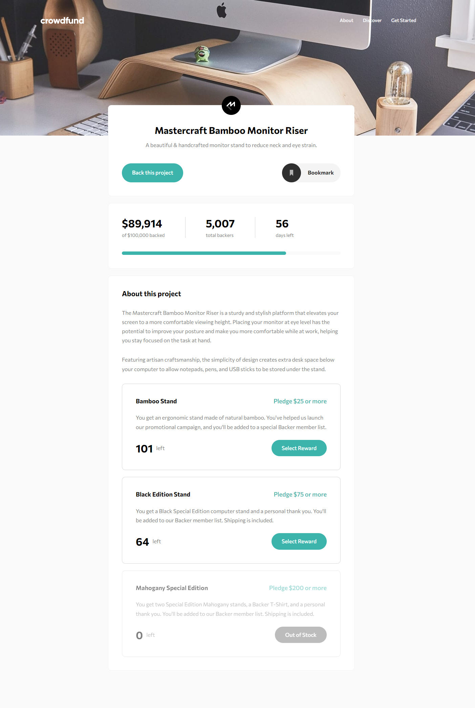

# Frontend Mentor - Crowdfunding product page solution

This is a solution to the [Crowdfunding product page challenge on Frontend Mentor](https://www.frontendmentor.io/challenges/crowdfunding-product-page-7uvcZe7ZR). Frontend Mentor challenges help you improve your coding skills by building realistic projects.

## Table of contents

- [Overview](#overview)
  - [The challenge](#the-challenge)
  - [Screenshot](#screenshot)
  - [Links](#links)
- [My process](#my-process)
  - [Built with](#built-with)
  - [What I learned](#what-i-learned)
  - [Continued development](#continued-development)
- [Author](#author)

## Overview

### The challenge

Users should be able to:

- View the optimal layout depending on their device's screen size
- See hover states for interactive elements
- Make a selection of which pledge to make
- See an updated progress bar and total money raised based on their pledge total after confirming a pledge
- See the number of total backers increment by one after confirming a pledge
- Toggle whether or not the product is bookmarked

### Screenshot



### Links

- Solution URL: [https://github.com/LeonardoR3D/frontend-mentor-challenge-005.git]
- Live Site URL: [https://leonardor3d.github.io/FMC-05-Crowdfunding-product-page/]

## My process

### Built with

- Semantic HTML5 markup
- CSS custom properties
- Flexbox
- Mobile-first workflow

### What I learned

I learned how to make animations using CSS and how to create event listeners with parameterized functions.

```css
@keyframes background-hidden {
  0% {
    opacity: 0.5;
    height: 100vh;
  }
  99% {
    opacity: 0;
    height: 100vh;
  }
  100% {
    height: 0;
  }
}

.modal-background.hidden {
  animation-name: background-hidden;
  animation-duration: 0.5s;
  animation-fill-mode: forwards;
}
```

```js
btnsSelectReward.forEach((btn, index) => {
  if (!mainCards[index].classList.contains("out-of-stock")) {
    btn.addEventListener("click", function () {
      selectReward(index);
    });
  }
});
```

### Continued development

After this project I understood even more the importance of using certain frameworks because the more things I added the more confusing my organization became.

## Author

- Frontend Mentor - [@LeonardoR3D](https://www.frontendmentor.io/profile/LeonardoR3D)
- Twitter - [@Crazy9_3D](https://twitter.com/Crazy9_3D)
